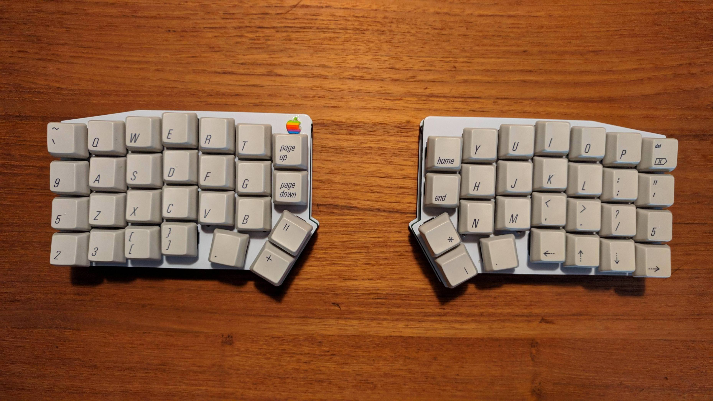
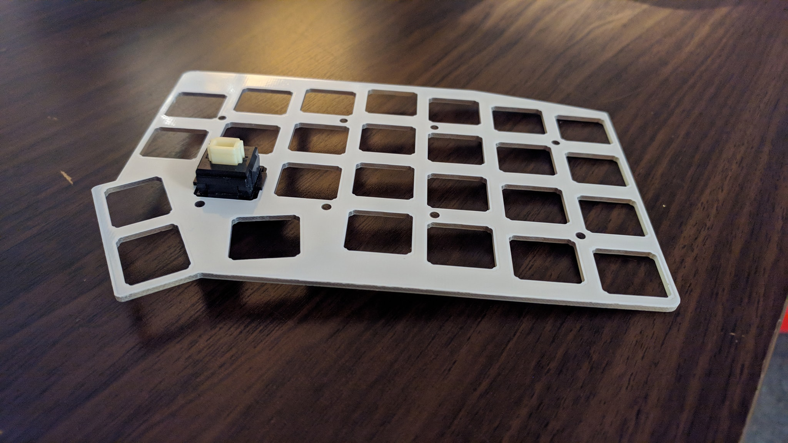
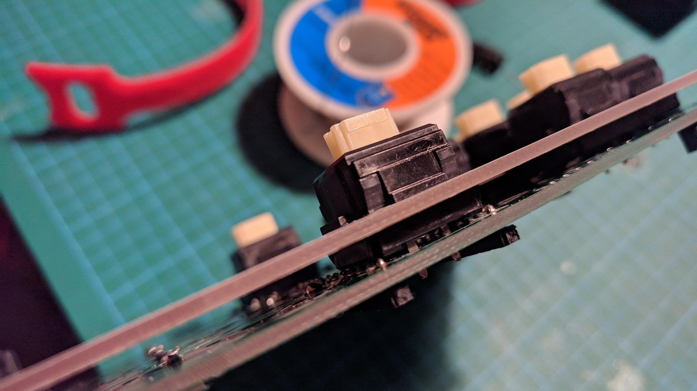
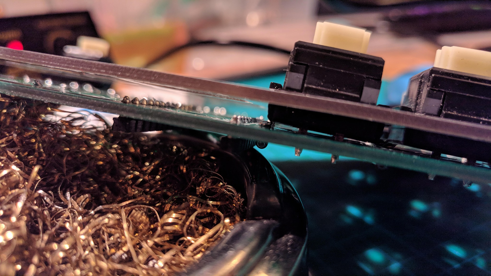
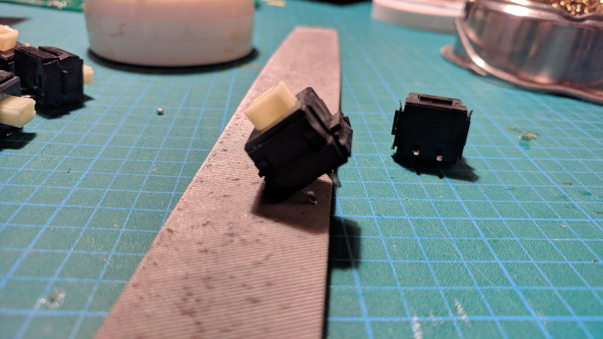
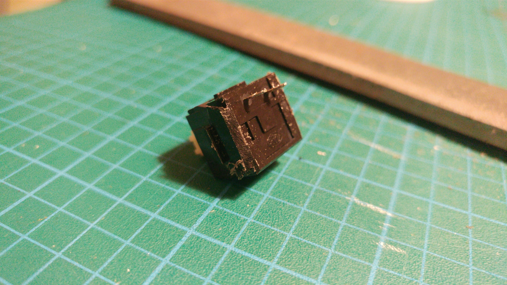

# Considerations when Using Alps-Style switches

If you're planning on putting ALPS-style switches in your ergotravel, there are a couple things you'll have to consider.

*A completed Alps build.*

Currently, the plates only allow for 2 1u keycaps in the thumbs. As such, you won't be able to put a 2u keycap in there.

*Alps ergotravel plate.*

Because the switches are ever-so-slightly wider than their MX counterparts, you'll have to file down the bottom left and right corners of the switches that sit on top of the ProMicro. This will allow the switch to sit flush upon the PCB. This is also true of the Iris and indeed any other keyboard that has switches right on top of the ProMicro.

*Alps switch resting upon promicro socket pins.*

You may have to use similar methods to accomodate diode leads in rare occurences. Try to ensure that all switches sit flush prior to soldering them.

*Alps switch resting upon diode leads.*

To do so, simply place a file on the table and run the corner of the switch along it at a 45-degree angle as pictured below.

Continue with the other bottom side of the switch until it sits flush on the PCB. This doesn't take much and shouldn't go through the housing at all.

When finished, the switches should sit flush against the PCB, the filed down corners now accomodating the promicro's sockets.

*Alps switch sitting flush on top of promicro.*

You'll also likely have to clip the leads of the switches that sit on top of the pro micro if you're using low-profile sockets or no sockets. These too may make contact with the promicro if left at their full length.
