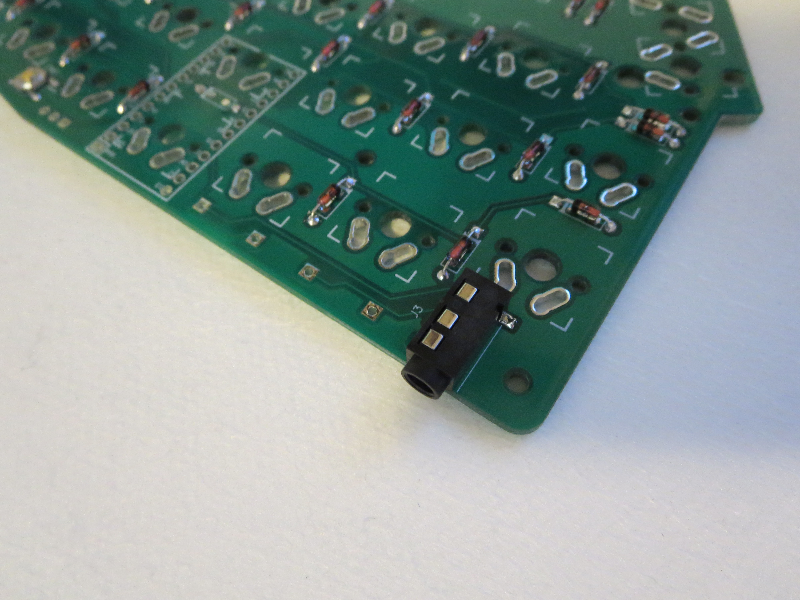

# ErgoTravel Build Instructions

---

## Review your parts

### Electronic Parts List

- [ ] 2 PCBs
- [ ] 2 5V/16MHz Pro Micros
- [ ] 2 Sockets (Note of the socket height. This will dictate what standoffs height you can use)
- [ ] 2 4.7k resistors. Only Through Hole is supported. (Optional if you want to use I2C)
- [ ] 2 surface mount TRRS Jacks (PJ-320D-A)
- [ ] 2 surface mount reset switches (switch 5.25.21.5 250gf Copper head)
- [ ] 54 1N4148 Diodes. Through Hole and SMD supported
- [ ] 1 TRRS Cable

### Optional: For RGB Underglow

- [ ] 2 WS2812 Strips

### Option 1: PCB Sandwich Case Parts List - External Screw Design

- [ ] 2 Top PCB Plates
- [ ] 2 Bottom PCB Plates
- [ ] 36 M2x4mm screws (18 per side)
- [ ] 18 M2x12mm standoffs (9 per side)

### Option 2: PCB Sandwich Case Parts List - Internal Screw Design

- [ ] 2 Top PCB Plates
- [ ] 2 Bottom PCB Plates
- [ ] 32 M2x4mm screws (16 per side)
- [ ] 16 M2x8mm standoffs (8 per side) (6mm standoffs may be used if ultra low profile sockets are used)

### Option 3: PCB Mount Case Parts List

- [ ] 4 PCBs (same PCBs will be used for Bottom Plates - 2 per side)
- [ ] 32 M2x4mm screws (16 per side)
- [ ] 16 M2x8mm standoffs (8 per side) (6mm standoffs may be used if ultra low profile sockets are used)

### Option 4: 3D Printed Case Parts List (3D Printed Case not available yet)

- [ ] Left Case Top
- [ ] Left Case Bottom
- [ ] Right Case Top
- [ ] Right Case Bottom

### Option 5: Acrylic Case Parts List (Acrylic Case not available yet)

- [ ] Left Case Top
- [ ] Left Case Mid Insert
- [ ] Left Case Bottom
- [ ] Right Case Top
- [ ] Right Case Mid Insert
- [ ] Right Case Bottom

### Switches and stabilizers

The number of switches and stabilizers depends on the desired configuration for the thumb switches.

| Configuration | Switches | 2U Cherry Stabilizer |
| :---: | :---: | :---: |
| 4x1U  |  54   |  0  |
| 2x1U + 1x2U  |  53   |  1  |
| 2x2U  |  52   |  2  |

---

## Prepare PCBs and Install Components

### Step 1: Place PCBs face up with thumbs facing inward.

To avoid building two left or two right halves, place the PCBs side by side with the thumbs facing toward each other.

### Step 2: Decide which half will be the master.

The Master half will be connected to the USB port.  This will decide where we install the I2C resistors. 
Note: In the end, it doesn't matter much if you have the resistors on the slave.

Divide the components in two halves and keep with each PCBs.
Put the 2 resistors with the master half.

Note: Unlike some other keyboards, there are no jumpers to configure for the left or right halves.

### Step 3: Install the diodes

Install diodes on **bottom side** of the board. On each half of the board, the diode beneath the pro micro will need to be installed on the **top side** of the board.  For V1.01, there is no longer a diode under the pro micro.

Use a straight edge to bend the diodes prior to installing them on the board.

Black line on the diode lines up with the square pad and white line on the PCB silkscreen, bend the legs and push it through.

Bands must match the bands on the silkscreen and the square pads.

Diodes ready to be installed on the left half. After inserting both legs into the PCB, bend the legs outward to keep the diodes in place when soldering.

Top view:

The diode beneath the pro micro will need to be placed on top of the PCB so that it does not come in contact with the pro micro.  

Bottom view:

Note the orientation of the diodes that are positioned horizontally.  It is important that the bands on the diodes match the bands on the silkscreen and the square pads.

Diodes ready to be installed on the right half.

Top view:

The diode beneath the pro micro will need to be placed on top of the PCB so that it does not come in contact with the pro micro.

Bottom view:

Note the orientation of the diodes that are positioned horizontally.  It is important that the bands on the diodes match the bands on the silkscreen and the square pads.

Once all of the diodes are in place they are ready to be soldered. After soldering, clip the legs on the diodes flush with the PCB.  Do not discard the legs from the diodes if you plan to install sockets for the pro micro.

Diodes soldered on the left half.

Top view:

Bottom view:

Diodes soldered on the right half.

Top view:

Bottom view:

### Step 4: (Optional for I2C) Install the resistors
**Note that I2C is currently not compatible with WS2812 RGB underglow**
If you are working on the Master Half, install the resistors near the top, on the top side.
You will need to make a solder bridge at the Jumper location on both halves to enable I2C communication. This jumper is located next to the resistors.  Bridge on the "bottom" side so that you have access to it once fully assembled.

If you are working on the slave side, continue to the next step. The slave side does not have resistors.  
If resistors are on installed the slave instead of the master, it should still work fine.

### Step 5: Install Reset Switch

Install Reset switch on the **bottom side** of the boards. This is a surface mount switch.

Apply some solder to one of the 4 pads. 

Place the switch in position.  Melt the pre-applied solder to "tack" the switch in place. Some recommend to put some solder on the 4 pads.  I find it easier to align the switch if only 1 pad has solder pre-applied. Using tweezers, you can hold the switch and gently touch the leg with the soldering iron and melt the solder. 

Let the solder solidify and solder the other legs.

### Step 6: Install TRRS Connector

Install TRRS Connector on the **bottom side** of the boards. This is a surface mount connector.  Apply some solder to one of the 4 pads; preferably to the side that had a single connection.

Place the connector in position.  Melt the pre-applied solder to "tack" the connector in place. Some recommend to put some solder on the 4 pads.  I find it easier to align the connector if only 1 pad has solder pre-applied. Using tweezers, you can hold it and gently touch the leg with the soldering iron and melt the solder.

 
Solder the other 3 connections.

  

### Step 7: Option 1 (recommended) Install Pro Micro Sockets 
Install Pro Micro Sockets on the bottom side of the boards. DO NOT SOLDER THE PRO MICRO.

Place the sockets on the boards and use some tape to hold them in place.  

Once in place, solder a single pin and then remove the tape.  While holding the PCB, press down on the socket with your finger and reflow the soldered pin with the iron.  Properly align the socket, remove the iron, and allow the socket to solidify.  Do not place your finger over the pin that is soldered.  It gets hot.

After you are satisfied with the alignment of the sockets, solder the pin on the opposite side of each socket to hold it in place. Solder the remaining pins.

### Step 7: Option 2 (not recommended) Install Pro Micro Headers
Install Pro Micro Headers on the bottom side of the boards. DO NOT SOLDER THE PRO MICRO.

PLACE IMAGE HERE

### Step 8: Validate your soldering job and test the diodes...
Validate that the diodes were installed correctly.  Once the switches are installed through the top plate, it will be close to impossible to replace the diodes without unsoldering everything.

### Step 9: Return to Step 3 and continue with the other half.
Only the first half is done...  Rinse and repeat...

Bottom view of the left PCB with all components installed:

Bottom view of the right PCB with all components installed:

---

## Decide on Layout and Install Stabilizers

### Step 1: Decide on your layout.
Depending on whether you want 4x1U, 2x1U+1x2U or 1x2U+2x1U or 2x2U, you will require 0, 1 or 2 2U PCB Mount stabilizers. 

### Step 2: Prepare Stabilizers
Depending on where you obtained your stabilizers, you may have to put them together before installing them.
When assembled, they look like this:

### Step 3: Install Stabilizer in PCB
If you want to lubricate your stabilizer or do anything special to them, now is the time...

When installing the stabilizers, the twin legs as shown here:

are installed towards the "outside" of the PCB.  Note that the hole diameters for installing the stabilizers are not the same between the two sides.  The stabilizer should only fit one way.

To install the Stabilizer, first pass the small single hooks (on the wire side) through the larger holes (towards the center of the board).  

Then press down on the other side of the stabilizers (outside edge of the PCB) to engage the clips within the smaller holes.  You may have to squeeze gently on the twin legs for them to go through the hole.  Once through, the stabilizer will "snap" in place.
 
 

The legs should be fully snapped in place for the stabilizer to work properly.

 

---

## Install Standoffs for "Internal Screws PCB Case" 
**This step only applies if you have an Internal Screw PCB Top Plate**

_Ignore if you use the "External Screws PCB Case".  V1.0 Prototypes used these plates_

Access to the screws is not possible from above the top plate.  Install the screws and standoffs right now.

---

## Install Switches

Place the Top plate above the PCB and install switches at each corner to hold everything in place.  Solder the four switches in while pressing down on the PCB to push the PCB and switches together.

Once the corner switches are installed, install the remaining switches and solder them in place.

---
## Test and Flash Pro Micros

It's easier to replace a faulty Pro Micro if it's not already installed.

---
## Install Pro Micro

Pro Micro Orientation - it is important to orient the controllers in the correct direction.  The Pro Micro on the left side of the keyboard will have the components facing toward the bottom plate. The Pro Micro on the right side of the keyboard will have the components facing the PCB. NOTE: The PCB has an indication of the **RAW** pin.  Match this pin with the silscreen of the Pro Micro.

In the photo above, the left side of the keyboard is on top and the right side of the keyboard is on the bottom.

### Steps for completing Pro Micro installation using low profile sockets

Tape over the sockets using painter's tape so that the Pro Micro does not get soldered directly to the sockets. Press firmly on the tape in order to see the outline of the sockets.

Use the diode legs that were saved from the previous steps.  Insert a couple of the pins in order to line everything up and then place the Pro Micros on top of the sockets. Make sure to face one up and the other down.  **Do not face the Pro Micros in the same direction** Insert pins into the remaining holes.

Once the pins are in place, solder the Pro Micros. After soldering, use flush cutters to trim the excess wire. Use a small flathead screwdriver to pry the Pro Micros out of the sockets in order to remove the tape.

### (Optional) Use hot glue to reinforce USB micro connectors

After gluing around the edges of the USB connectors, us a sharp hobby knife to cut off any excess glue.

