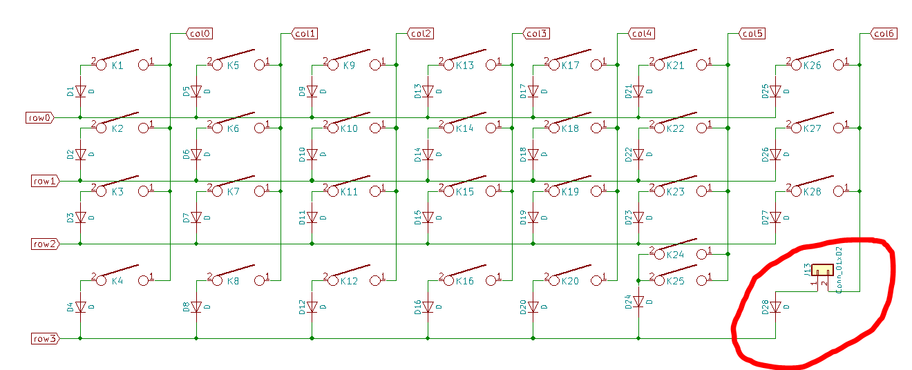
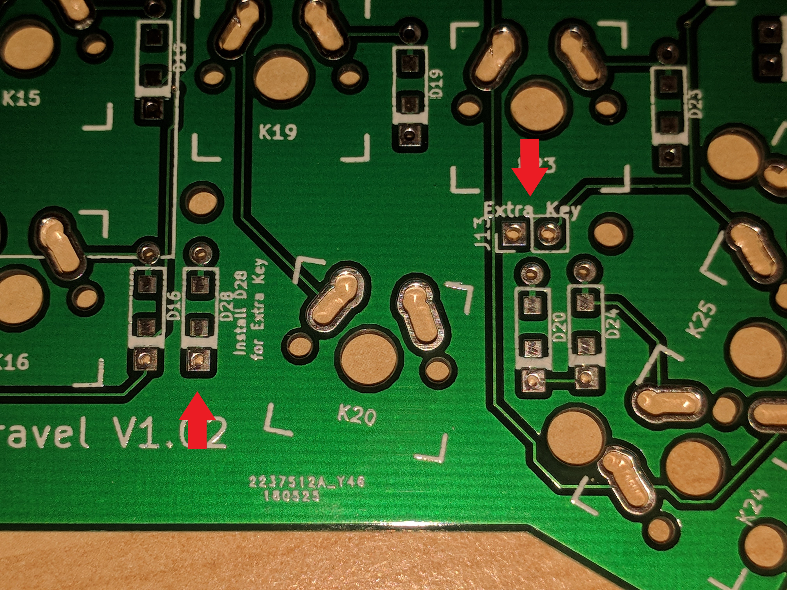

### Installing an extra Thumb Key

There is an unused position in the matrix.

As of V1.02, this empty position has been made accessible on the PCB.

Install D28 and handwire the additional switch to the 2 pin header located near the thumb cluster.

This extra key allows a modification to the keyboard similar to this [one](https://imgur.com/a/Vr0oH#H5ut7ZZ) on the Iris.
