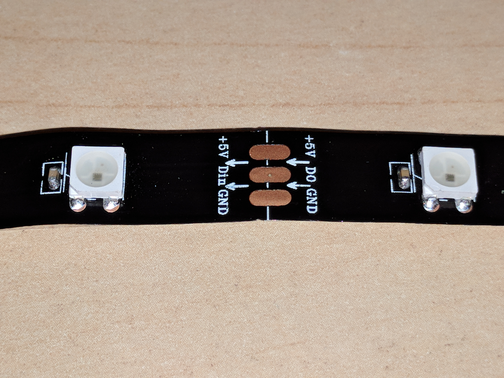

### Instructions on how to install RGB LED Strips as RGB underglow

1. Decide which half will be your master.  The master will use the DI pin on the header next to the pro micro. VCC and gnd on that same header will also be used.

2. Wire on the master from DI to Din of the Led strip.  Do the same with VCC and GND.

3. Wire from Do (other end of the strip) to the extra data pin (resistor next to TRRS connector) (make sure you don't use the resistors; I2C is not yet compatible with RGB underglow. Also make sure you don't have jumpered/soldered the I2C jumper). 

4. On the slave half, the RGB data will appear on the same extra data pin on the resistor pad. This pin will go to the Din pad of the strip.

5. Wire VCC and GND from the header next to the pro micro to the VCC and GND pads of the led strip.

6. The Do pad of the slave RGB strip will not be connected anywhere.

This should complete the hardware assembly.

From a software point of view, make sure you enable the RGB features of the firmware as well as have the keycodes to change the RGB modes on one of your layers.
