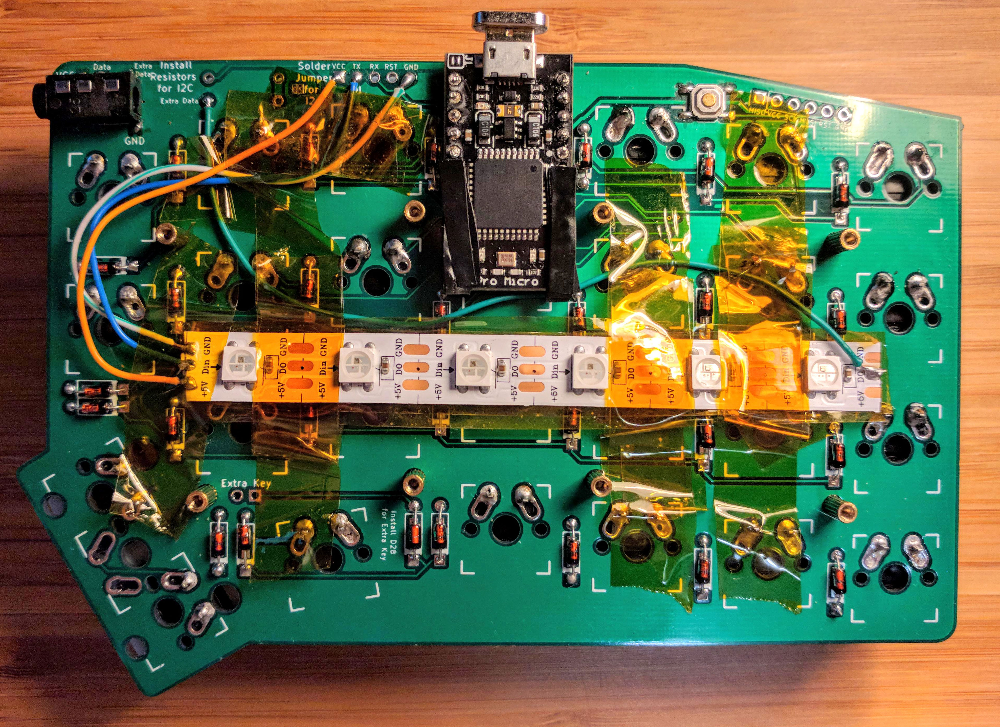
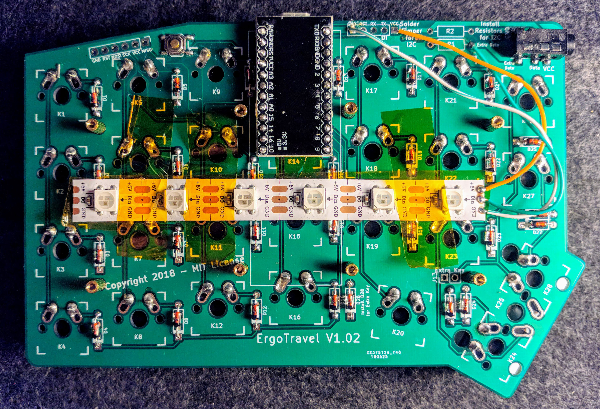
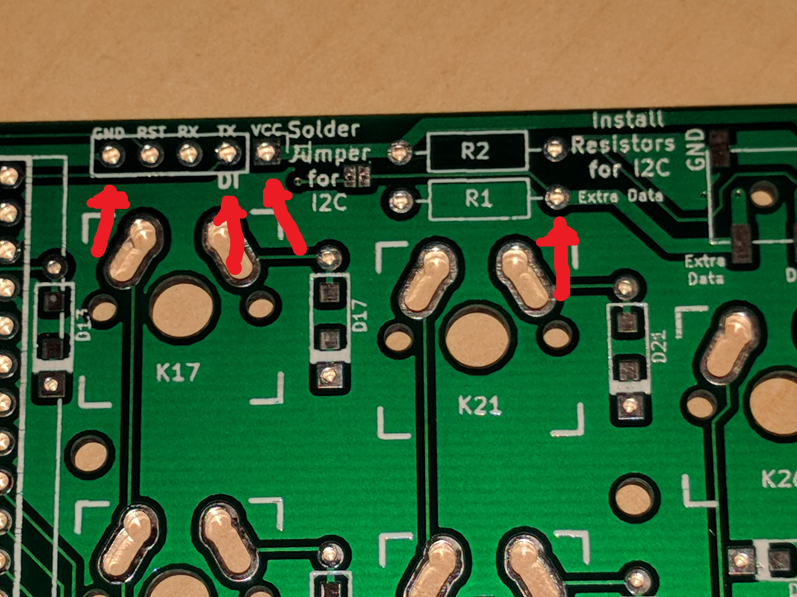
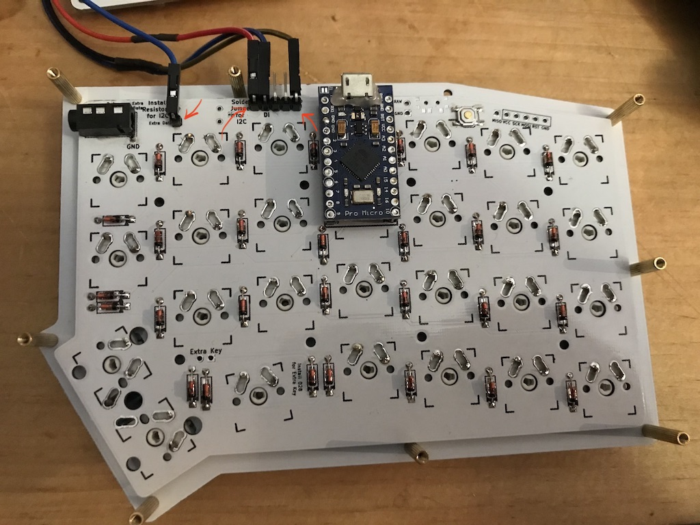
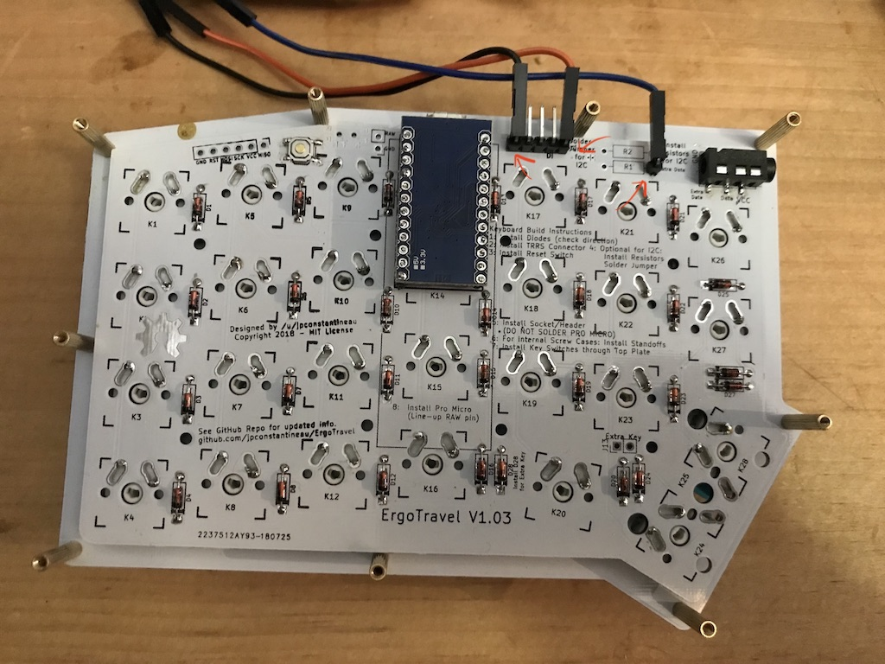
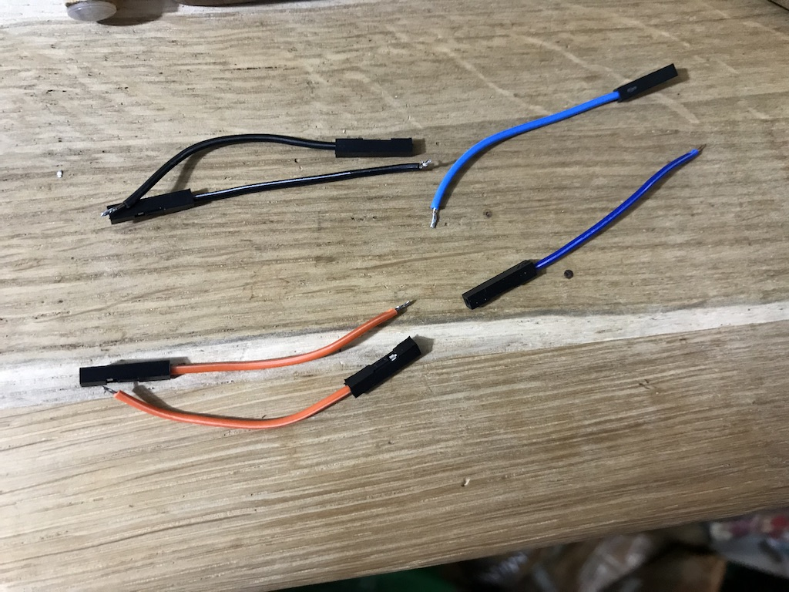
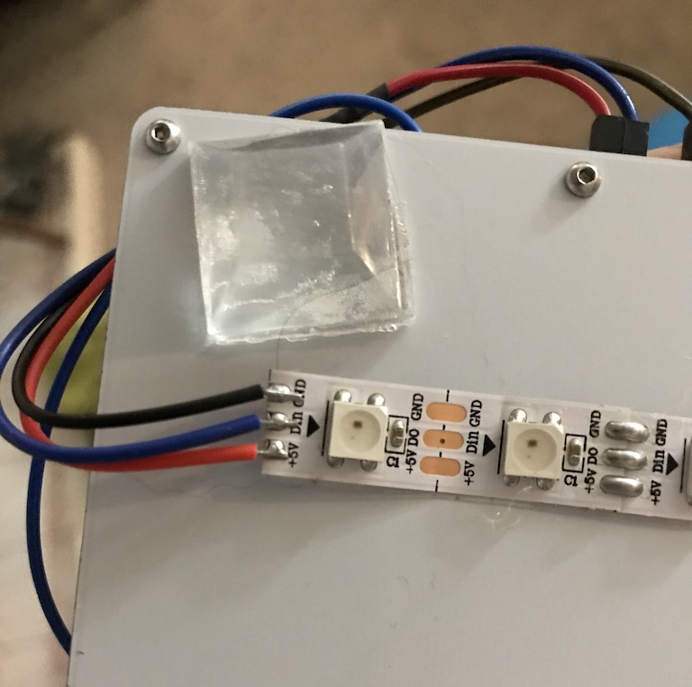

## Instructions on how to install RGB LED Strips as RGB underglow


## Software Changes
From a software point of view, make sure you enable the RGB features of the firmware as well as have the keycodes to change the RGB modes on one of your layers.

Update firmware to enable RGB underglow: the  `rules.mk` file must contains the following line:

```
RGBLIGHT_ENABLE = yes
```

To control the RGB underglow see the QMK [feature documentation](https://github.com/qmk/qmk_firmware/blob/master/docs/feature_rgblight.md)

There are a few options on how you can install the RGB strips.

## Hardware Changes: Option 1: RGB Strips at the Bottom of PCB

1. Decide which half will be your master.  The master will use the DI pin on the header next to the pro micro. VCC and GND on that same header will also be used.

### Master Half

2. Wire from the TX pad on the PCB to Din pad of the LED strip.  
3. Wire from the GND on the PCB to the GND on the LED strip.
4. Wire from the VCC on the PCB to the +5V on the LED strip.
5. At the other end of the LED strip, wire from DO to the extra data pad on the PCB (resistor next to TRRS connector). 

* Make sure you don't use the resistors; I2C is not yet compatible with RGB underglow. Also make sure you haven't jumpered/soldered the I2C jumper.

When you're done with the master half, it should look like this. With less kapton tape.


*This is what the underside of the MASTER half should look like*

### Slave Half

6. On the slave half, the RGB data will appear on the same extra data pin on the resistor pad. This pin will go to the Din pad of the strip.
7. Wire VCC and GND from the header next to the pro micro to the VCC and GND pads of the led strip.
8. The Do pad of the slave RGB strip will not be connected anywhere.

When you're done with the slave half, it should look like this. 


*This is what the underside of the SLAVE half should look like*


This should complete the hardware assembly.


## Hardware Changes: Option  2: RGB Strips at the Bottom of Bottom Plate - using Dupont Connectors

First, check that you have all required parts:

- 14 RGB LEDs (e.g. from WS2812/ SK6812 LED strips)
- rectangular header connectors (e.g. [PRPC040SBAN-M71RC](https://www.digikey.ca/product-detail/en/sullins-connector-solutions/PRPC040SBAN-M71RC/S1111EC-40-ND/2775294))  
  these need to be broken into 3 pieces, 2x 5 pins and 2x 1 pin
- 4x female header connectors to attach to your LED strips. Later these will be cut in half, we need 7 halves

The connectors are only required if you want to be able to detach the RGB strip, which can be useful if you need to work on the PCB after you've completed soldering.   The below images assume you're using the left side of the keyboard to control your RGB strip.

Please make sure you don't use the resistors; I2C is not yet compatible with RGB underglow. Also make sure you don't have jumpered/soldered the I2C jumper.

---

1. Solder all rectangular connectors onto both halves.

Back of left hand:   
Back of right hand: 

2. Cut female header connectors in half to prepare them to be attached to the LED strips:


3. Wire the header connectors on both RGB strips: black for GND, red for VCC, blue for data


4. on one RGB strip, wire a header connector on the other side of the RGB strip to Do.

5. Attach female and male header connectors: Attach VCC, GND and Di on the left side, as well as Do to the single extra pin.
On the right side, Attach VCC and GND, and Di from the single extra pin.

Back of left hand:   
Back of right hand: 

This should complete the hardware assembly.


